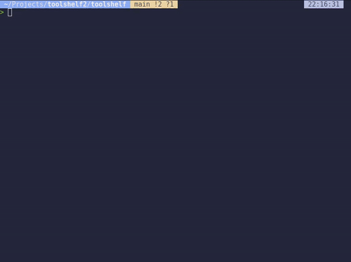

## Why ToolShelf?
ToolShelf simplifies the management of tool-related information, providing a single command-line interface to handle your tool inventory. It's designed to be straightforward, making it perfect for users who want a quick and efficient way to organize their tools without the need for a complex database or software solution.

In essence, ToolShelf is like a digital toolbox for your terminal tools, helping you keep everything organized and easily accessible, so you can focus on your work without worrying about tool management.

## Compatibility
!! Currently only works for Linux or WSL !!

## Integration with Other Package Managers

There are many package managers like npm, pip, apt, brew, and cargo that help you manage libraries and packages for different programming languages and systems. ToolShelf complements these package managers by providing a unified way to manage all your tools, regardless of their installation method.

**Key Features:**
Tool Management: Quickly add new tools, list all your tools, update existing ones, or remove tools you no longer need.

  - Tool Management: Quickly add new tools, list all your tools, update existing ones, or   remove tools you no longer need.
 - Data Persistence: Stores all tool data in a SQLite Database.
   located in your home directory under ~/.local/share/toolshelf, ensuring
   that your tool information is always saved and easily retrievable.
 - Easy Installation and Usage: Simple to install via pip and easy to
   use through straightforward command-line commands.
 - Lightweight and Portable: Designed to be lightweight and run
   efficiently on any system with Python installed, making it ideal for
   use in various environments.

## Commands
  - Enter to start the tool you have selected.
  - Delete to delete a tool.
  - E to edit a tool.
  - P to copy the command.

## How to install
pip install toolshelf-ui

## How to build
Use the build.sh script to build locally.

